<div align="center">


[](https://git.io/typing-svg)

<br>


<br>


<br>

[](https://github.com/DeveshShukla23)
[](https://www.linkedin.com/in/devesh-shukla23)
[](mailto:shukladevesh40@gmail.com)

</div>

---

<div align="center">

**The three ///M stripe colors that power this entire project**

 `#008AC9 — M Blue`
&nbsp;&nbsp;&nbsp;
 `#2B115A — M Purple`
&nbsp;&nbsp;&nbsp;
 `#F11A22 — M Red`

</div>

---

## 🤔 What does a real data analyst do with 4,569 rows of messy BMW sales data?

Not just clean it. Not just plot it.

They build a **complete end-to-end business intelligence story** — from corrupted raw Excel files, through SQL warehousing and deep Python analysis, all the way to a boardroom-ready Power BI dashboard.

**4 Phases. 8 countries. 12 models. €785.58M in revenue. Zero shortcuts.**

> 💡 *"Most people analyse clean data. I started with the mess — because that's what real analyst jobs actually look like."*

---

## 📊 Business Numbers at a Glance

<div align="center">

| 💰 Total Revenue | 📈 Gross Profit | 📉 Profit Margin | 🚗 Units Sold | 🧾 Transactions | ⭐ Avg Satisfaction |
|:---:|:---:|:---:|:---:|:---:|:---:|
| **€ 785.58M** | **€ 196.39M** | **25.00%** | **12K** | **4,522** | **4.08 / 5** |

| 📅 Years | 🌍 Countries | 🚘 Models | ⛽ Fuel Types | 👥 Customer Segments | 💱 Currencies |
|:---:|:---:|:---:|:---:|:---:|:---:|
| **2020–2024** | **8** | **12** | **4** | **4** | **7+** |

</div>

---

## 🏗️ 4-Phase Project Pipeline

```
╔═══════════════════════════════════════════════════════════════════════════╗
║                  BMW GLOBAL SALES — ANALYTICS PIPELINE                   ║
╠═══════════╦═══════════════════════════════════╦═══════════════════════════╣
║  Phase    ║  Tool & What Was Done             ║  Output                   ║
╠═══════════╬═══════════════════════════════════╬═══════════════════════════╣
║  Phase 1  ║  Excel   — Raw Data Inspection    ║  Quality Audit Report     ║
║  Phase 2  ║  SQL     — 8 Business Queries     ║  MySQL Data Warehouse     ║
║  Phase 3  ║  Python  — EDA + Cluster + Fcst   ║  13 BMW M5 Black Charts   ║
║  Phase 4  ║  Power BI — 4-Page Dashboard      ║  BMW M5 Black Dashboard   ║
╚═══════════╩═══════════════════════════════════╩═══════════════════════════╝
```

---

## 🎨 BMW M5 Competition Black — Visual Theme

> Every chart in Phase 3 was built using a custom BMW M5 Competition Black matplotlib theme — matching the exact color DNA of the ///M badge

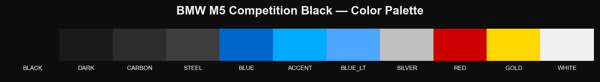

---

## 🔵 Phase 1 — Excel: Raw Data Inspection

**Goal:** Audit the raw dataset completely before touching a single value. Document every quality problem first.

The raw file arrived as **4,569 rows × 29 columns** — and it was full of real-world data quality problems:

| Problem Found | Column | Count | Decision |
|---|---|---|---|
| Corrupted / future dates | `Sale_Date` | 100% rows | Rebuild from `Year` + `Month` |
| Column name typos | `CUSAtomer_Segment`, `CUSAtomer_Gender` | — | Create cleaned versions |
| Negative satisfaction scores (−1) | `Satisfaction_Score` | 422 rows | Flag → `BAD SCORE` |
| Invalid customer ages (< 18 or > 80) | `Customer_Age` | 398 rows | Flag → `BAD AGE` |
| Bad revenue entries | `Total_Revenue_Local` | 47 rows | Flag → `BAD REVENUE` |
| NULL values | Multiple columns | Varying | Median / Mode / 'Unknown' |
| Mixed currency formats | `Currency` | Multiple | Standardise → `Currency_Cleaned` |

**Output:** Complete data quality audit with a column-by-column cleaning strategy before any analysis.

---

## 🟣 Phase 2 — SQL: Business Queries (MySQL)

**Goal:** Load the cleaned dataset into MySQL and extract 8 actionable business answers.

```sql
-- Profit Margin by Region — finding BMW's most and least efficient markets
SELECT
    Region,
    COUNT(*)                                                    AS Total_Sales,
    ROUND(SUM(Revenue_EUR), 2)                                  AS Total_Revenue_EUR,
    ROUND(SUM(Gross_Profit_EUR), 2)                             AS Total_Profit_EUR,
    ROUND((SUM(Gross_Profit_EUR) / SUM(Revenue_EUR)) * 100, 2) AS Profit_Margin_Pct
FROM bmw_sales_data
WHERE Total_Revenue_Local_Flag = 'OK'
GROUP BY Region
ORDER BY Total_Revenue_EUR DESC;
```

| # | Query | Business Question Answered |
|---|---|---|
| 1 | Revenue by Year | How has BMW grown year-on-year from 2020 to 2024? |
| 2 | Revenue by Region | Which global markets generate the most revenue? |
| 3 | Best Selling Models | Which models lead on revenue and units sold? |
| 4 | Customer Segment Analysis | Which customer type is the most profitable? |
| 5 | Gender Analysis | Does gender affect revenue or satisfaction? |
| 6 | Quarterly Trends | Where are the seasonal peaks and troughs? |
| 7 | Fuel Type Analysis | How is the EV/Hybrid shift affecting the bottom line? |
| 8 | Overall Business Summary | What is BMW's complete financial health at a glance? |

**SQL Concepts Applied:**

| Concept | Applied In |
|---|---|
| ✅ `CREATE DATABASE` / `CREATE TABLE` | Database and table setup |
| ✅ `SUM` `COUNT` `AVG` `ROUND` | All 8 revenue and profit queries |
| ✅ `WHERE` flag filters — `Flag = 'OK'` | Data quality control in every single query |
| ✅ Derived Profit Margin % calculation | Year and Region queries |
| ✅ `IS NOT NULL` filters | Gender and Fuel Type queries |
| ✅ Multi-column `GROUP BY` | Quarterly trend analysis |
| ✅ `ORDER BY DESC` ranking | Model and Region queries |
| ✅ `DECIMAL` financial precision | Revenue, COGS, Gross Profit columns |

---

## 🔴 Phase 3 — Python: EDA, Clustering & Forecasting

> **Visual Theme:** BMW M5 Competition Black — all 13 charts built with custom dark matplotlib theme
> `Background #0D0D0D` · `Blue #008AC9` · `Purple #2B115A` · `Red #F11A22` · `Silver #C0C0C0` · `Gold #FFD700`

---

### 📊 Chart 1 — Key Variable Distributions

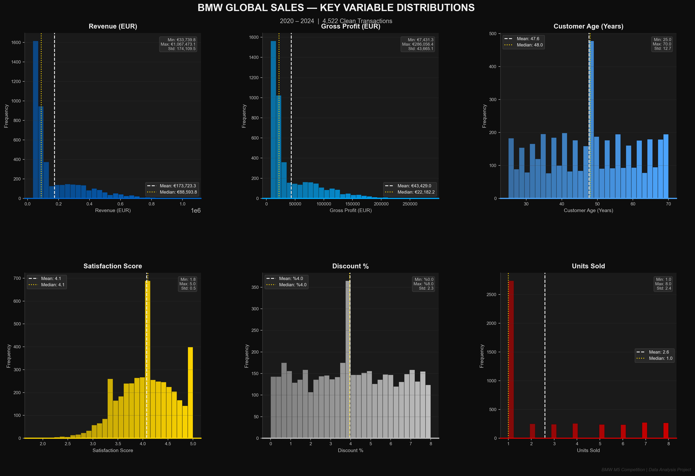

**What the data is telling us:**
- **Revenue is right-skewed** — most BMW transactions are under €200K, but ultra-premium deals up to €1.06M (Mean: €173.7K, Median: €88.6K) sharply pull the mean higher. This is textbook luxury brand behaviour.
- **Customer Age peaks at 47–48 years** (Mean: 47.6, Median: 48.0) — BMW's core buyer is a mid-career professional in their late 40s. Every marketing campaign should be built around this.
- **Satisfaction is left-skewed** (Mean: 4.1, Median: 4.1) — the overwhelming majority score 4.0–5.0. Extremely few unhappy customers. BMW is delivering on its brand promise.
- **Discount % is completely flat and uniform** (0–8%, Mean: 4.0%) — no pattern, no strategy. Discounts are 100% dealer-driven with no structure behind them.
- **Units Sold** — median is 1. The vast majority of transactions are single-unit retail purchases.

> 💡 **Business Insight:** The uniform, random discount distribution is a hidden profit leak. BMW has no structured discount policy — dealers apply discounts arbitrarily. A performance-linked tiered discount framework could protect **1–2% gross margin** across all 8 markets without losing a single customer.

---

### 📊 Chart 2 — Correlation Matrix

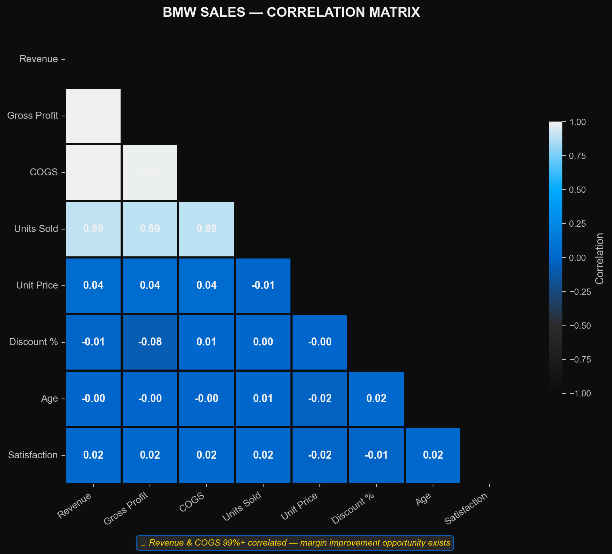

**What the data is telling us:**
- **Revenue ↔ Gross Profit = 0.99+** — margin is perfectly consistent at every transaction size ✅
- **Revenue ↔ COGS = 0.99+** — costs scale at the exact same rate as revenue. Zero economies of scale, anywhere.
- **Revenue ↔ Units Sold = 0.89** — Corporate Fleet bulk purchases are the primary revenue engine
- **Discount % ↔ Revenue = −0.01** — discounts generate zero additional revenue. Pure margin destruction with no commercial upside.
- **Discount % ↔ Gross Profit = −0.08** — more discount actively hurts profitability. It achieves nothing positive.
- **Satisfaction ↔ Everything = ~0.02** — satisfaction is completely independent of revenue, discount, and age. BMW delivers a consistent experience regardless of transaction size.

> 💡 **Business Insight:** The Revenue–COGS near-perfect correlation is the most critical finding in the entire dataset. BMW is scaling costs at exactly the same rate as revenue — **zero operational leverage from 5 years of growth.** A cost optimisation programme targeting 27%+ gross margin could unlock **€15M+ additional annual profit** without acquiring a single new customer.

---

### 📊 Chart 3 — Annual Revenue & Profit Trend (Animated)

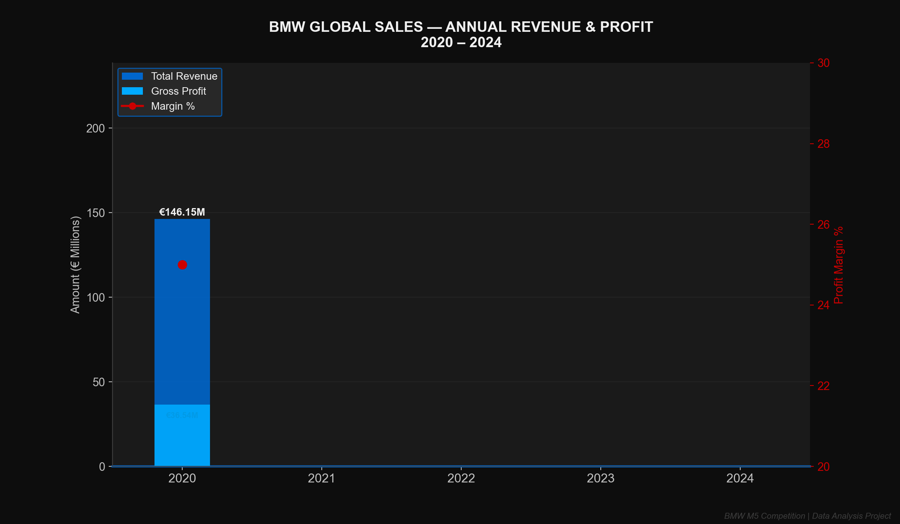

> 🎬 *This chart is animated — watch the bars build year by year with the profit margin line tracking flat across all 5 years*

**What the data is telling us:**
- **2024 = all-time record at €190.8M** — strongest year in BMW's 5-year dataset ✅
- **2021 drops to €138.5M** — COVID-19 supply chain disruption is visible and precisely quantified at −5.2% YoY
- **+30.6% total revenue growth** across 5 years — a solid CAGR of ~6.9% per year
- **The red margin line is completely horizontal** — locked between 24.9% and 25.1% every single year. Zero improvement despite strong top-line growth.
- **2023–2024 is the largest two-year acceleration** in the entire dataset — momentum is building

> 💡 **Business Insight:** BMW is working harder every year for the exact same margin return. A company growing at 6.9% CAGR should be gaining operational leverage — the fact that margin has not moved even 0.1% in 5 years points to a structural cost management problem that sales growth alone will never fix.

---

### 📊 Chart 4 — Monthly Revenue Heatmap

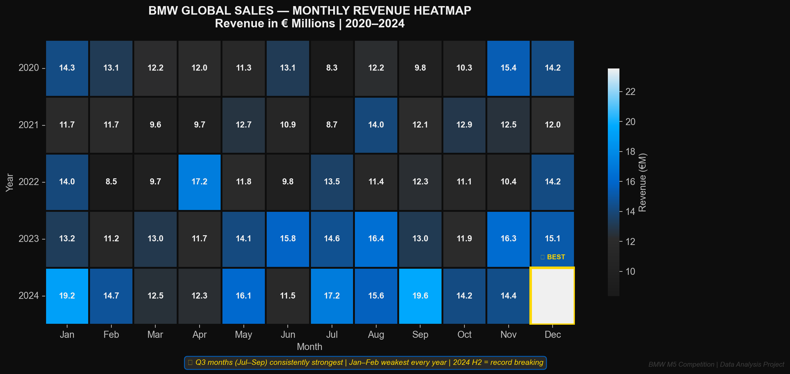

**What the data is telling us:**
- **Q3 (Jul–Sep) is consistently the brightest band every year** — peak demand without a single exception across all 5 years
- **Jan–Feb is consistently the darkest every year** — the weakest two months, year after year, perfectly predictable
- **2024 Sep = €19.6M** — the single best month in the entire 5-year dataset 👑
- **2024 Jan = €19.2M** — a striking outlier; an unusually strong January that broke the historical seasonal pattern
- **2021's entire row is visibly muted** — COVID impact spread uniformly across all 12 months of that year
- **2024 H2 = record-breaking** — second half of 2024 was the strongest 6-month period in the dataset

> 💡 **Business Insight:** BMW's seasonal pattern is reliable enough to be a financial planning tool. Production scheduling, dealer inventory builds, and marketing spend should be calibrated to this grid. A targeted Q1 activation campaign (Feb–Mar specifically) could close the seasonal gap and generate **€5–8M in incremental annual revenue** with zero new products.

---

### 🗺️ Chart 5 — World Map (Interactive)

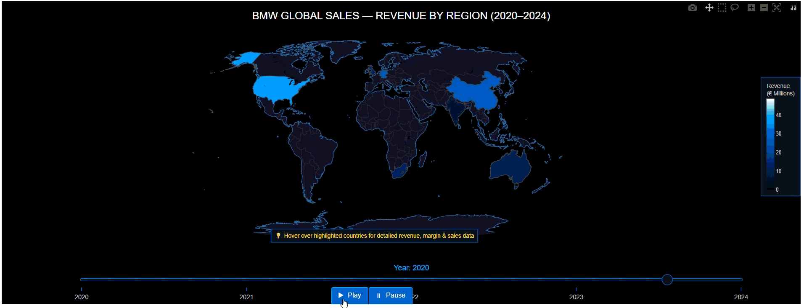

**What the map reveals:**
- **USA = consistently the brightest country** — dominant revenue market across all 5 years
- **China growing brighter year by year** — rapid revenue expansion clearly visible in the animation
- **India = barely visible** — 1.4 billion people and a fast-growing luxury class, yet almost invisible on BMW's global map
- **UAE punches well above its geographic size** — premium pricing driving outsized revenue per capita
- **Germany = steady** — reliable home market performance throughout all 5 years

> 💡 **Business Insight:** The map makes India's underperformance impossible to ignore — a country of 1.4 billion people with a surging luxury class generating only €47.25M is the single largest untapped opportunity in the entire dataset.

---

### 📊 Chart 6 — Regional Revenue & Margin Analysis

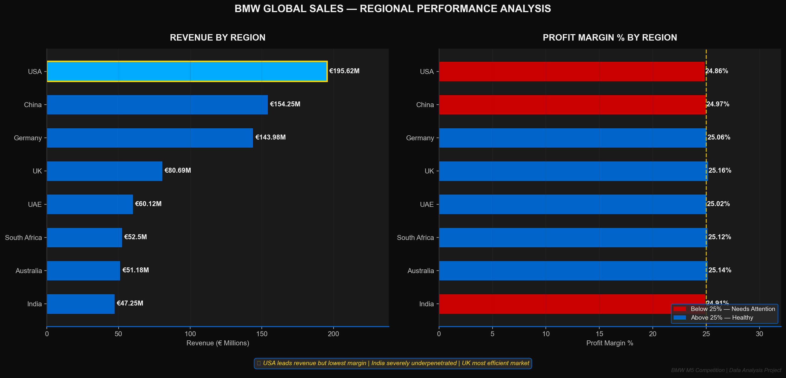

**What the data is telling us:**
- **USA = #1 revenue at €195.62M** — but also **lowest margin at 24.86%** (red bar, below 25% benchmark) ⚠️
- **China = #2 volume at €154.25M** — a €41M gap vs USA despite only 156 fewer transactions. Major per-unit pricing gap exists.
- **Germany = 25.06% margin** — home market operational efficiency advantage is real and measurable
- **UK = most efficient at 25.16%** — highest margin in the dataset with solid mid-range revenue
- **India = last at €47.25M** — also below 25% margin (24.91%, red bar). Low volume AND low efficiency simultaneously.
- **South Africa and Australia** both above 25% benchmark — smaller markets but well-managed

> 💡 **Business Insight:** USA is BMW's largest market and simultaneously its least efficient. Aggressive dealer incentives are eating margin visibly. Fixing USA margin by just **0.5 percentage points = +€1M annual profit, zero new customers required.** India needs a completely separate market entry strategy — it cannot be treated as an extension of the existing approach.

---

### 📊 Chart 7 — Model Performance Analysis

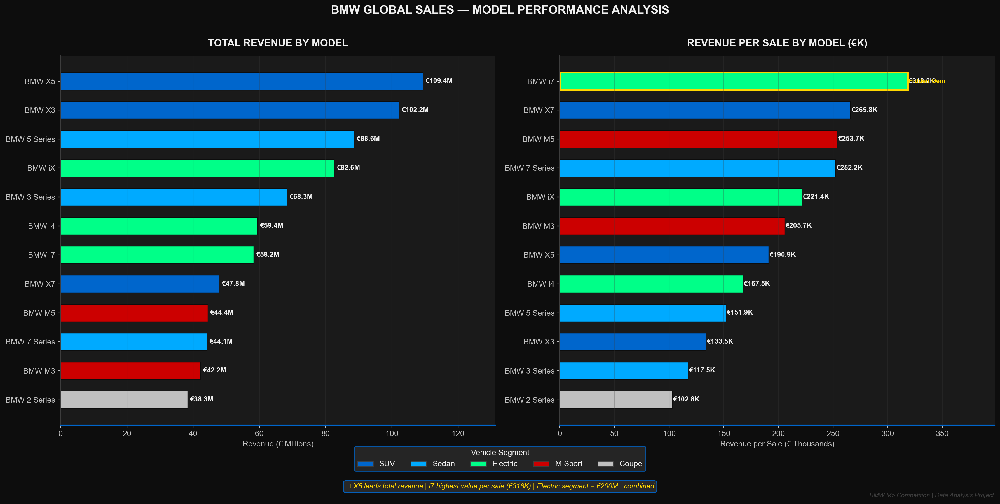

**What the data is telling us:**

**Left — Total Revenue by Model:**
- **BMW X5 = #1 at €109.4M** — premium SUV positioning working perfectly at scale ✅
- **BMW X3 = #2 at €102.2M** — strong but in the same SUV family, concentration risk
- **BMW iX = €82.6M** — the EV flagship performing strongly despite being newer
- **BMW M5 (€44.4M) and M3 (€42.2M)** — M Sport models generating strong revenue but nowhere near their potential
- **BMW 2 Series = last at €38.3M** — entry-level diluting portfolio premium average

**Right — Revenue per Sale by Model:**
- **BMW i7 = HIDDEN GEM at €318.9K per transaction** — highest value per sale in the entire portfolio 👑
- **BMW X7 = €265.8K** — ultra-premium SUV buyers exist in volume
- **BMW M5 = €253.7K per sale** — when sold, M Sport delivers exceptional per-unit value
- **BMW 2 Series = €102.8K** — lowest, confirming entry-level dilution effect

> 💡 **Business Insight:** The BMW i7 charges €318.9K per transaction but only generated 183 total sales — there are buyers willing to pay at this level, but BMW is not reaching enough of them. Expanding i7 availability and targeted marketing to India and UAE alone could significantly unlock additional revenue with minimal volume increase required.

---

### 📊 Chart 8 — Customer Segment Analysis

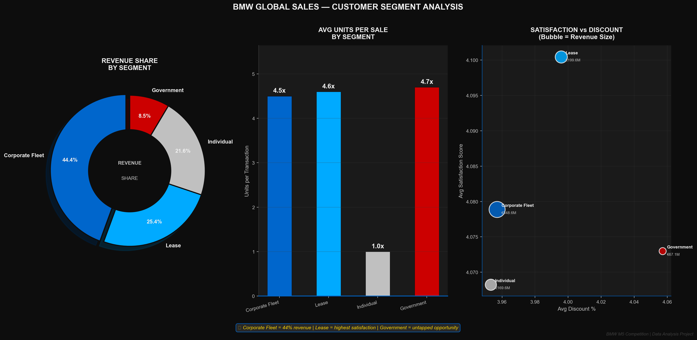

**What the data is telling us:**

**Revenue Share Donut:**
- **Corporate Fleet = 44.4%** of all BMW revenue from just 25% of transactions — bulk buying dominance
- **Lease = 25.4%** — solid second, with the best satisfaction profile
- **Individual = 21.6%** — retail buyers, always exactly 1 unit per sale
- **Government = 8.5%** — small share but with the highest bulk factor (4.7x units per sale)

**Units per Transaction:**
- Corporate Fleet: **4.5x** | Lease: **4.6x** | Government: **4.7x** | Individual: **1.0x** — always exactly one

**Satisfaction vs Discount Bubble:**
- **Lease segment = top-right position** — highest satisfaction (4.10) AND positioned at higher revenue bubble size
- **Discount has NO positive relationship with satisfaction** — higher discount does not make any segment happier
- **Government = rightmost bubble** — most discount given yet among the lower satisfaction scores

> 💡 **Business Insight:** BMW's 44.4% revenue concentration in Corporate Fleet is a dangerous single point of failure. Losing 2–3 large corporate accounts could trigger immediate revenue shock. The Lease segment — highest satisfaction, strong revenue share, growing profile — is the clearest and lowest-risk growth path available today.

---

### 📊 Chart 9 — Fuel Type & Gender Analysis

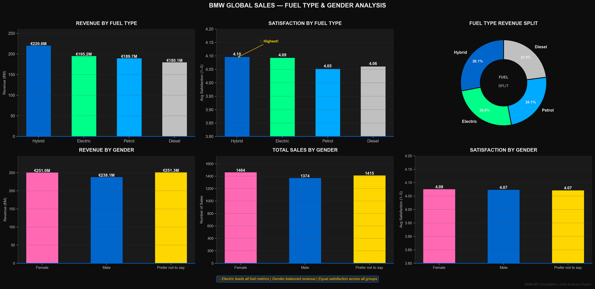

**Fuel Type Story:**
- **Hybrid leads revenue at €220.6M** (28.1% share) — volume champion, most transactions
- **Electric = second at €195.2M** and **leads satisfaction at 4.10** — technology premium is delivering a measurably better ownership experience
- **Petrol = €189.7M** — steady and reliable, but showing no growth signal
- **Diesel = lowest revenue (€180.1M) AND lowest satisfaction (4.06)** — declining asset with EU emission regulations incoming
- Revenue split is remarkably even — BMW successfully serves all fuel preferences today

**Gender Story:**
- **Female: €251.0M** | **Male: €238.1M** | **Prefer not to say: €251.3M** — within just €13M of each other
- **Female buyers slightly lead in transaction count** (1,464 vs 1,374 male) — genuinely surprising for a luxury auto brand
- **Satisfaction equal across all three groups** (4.07–4.08) — BMW delivers a completely gender-neutral experience ✅
- **'Prefer Not to Say' = €251.3M** — highest revenue group and must never be excluded from any segmentation strategy

> 💡 **Business Insight:** Electric vehicle customers are measurably and consistently the happiest BMW buyers. This is simultaneously an environmental strategy signal, a customer satisfaction signal, and a regulatory compliance signal. Accelerating the EV portfolio will improve overall NPS, reduce churn risk, and position BMW ahead of incoming EU and UK emission regulations — all three wins from one strategic decision.

---

### 📊 Chart 10 — K-Means Elbow & Silhouette (Optimal K)

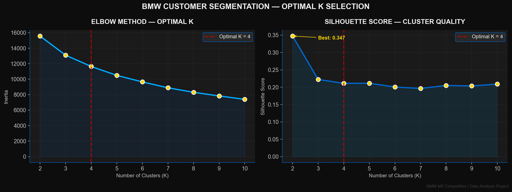

**What the charts are telling us:**
- **Elbow curve bends at K=4** — inertia drops sharply from K=2 to K=4, then flattens (diminishing returns beyond 4)
- **Silhouette score = 0.347 at K=2**, peaks early then stabilises — K=4 balances mathematical quality with business interpretability
- **K=3 would incorrectly merge** distinct customer types into false groups
- **K=5+ creates overlapping micro-segments** with no meaningful commercial difference

> 💡 **Why K=4 is the right business answer:** Four segments maps exactly to BMW's real-world commercial reality — Fleet Corporates, Everyday Individuals, Value Seekers, and Premium Buyers. Each group requires a fundamentally different pricing strategy, sales approach, and CRM programme. Anything fewer loses signal. Anything more adds noise.

---

### 📊 Chart 11 — K-Means Customer Segmentation Results (K=4)

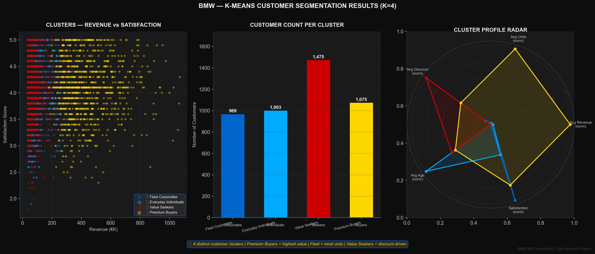

**4 Clusters Discovered — and what to do with each:**

| Cluster | Size | Name | Profile | Action Required |
|:---:|:---:|:---:|:---:|:---:|
| 🔵 | **969** | Fleet Corporates | High units, volume-driven, stable satisfaction | Dedicated account managers, volume contracts, SLA guarantees |
| 🩵 | **1,003** | Everyday Individuals | Mid revenue, 1 unit/sale, average satisfaction | Financing options, accessory upsells, service bundles |
| 🔴 | **1,475** | Value Seekers | Price-sensitive, highest discount, lower revenue | Structured promotions, certified pre-owned pathway |
| 🟡 | **1,075** | Premium Buyers | Highest revenue, quality-driven, low discount | Concierge service, exclusive model previews, VIP events |

**Radar Chart reveals:**
- **Value Seekers (red)** — high on Avg Discount, low on Revenue — discount-chasing profile confirmed
- **Premium Buyers (yellow/gold)** — widest shape overall — high revenue, high units, broad profile
- **Fleet Corporates (blue)** — strong on Units dimension — bulk buying clearly visible
- **Everyday Individuals (light blue)** — smallest radar shape — lowest across all dimensions

> 💡 **Business Insight:** One-size-fits-all marketing is a direct revenue leak. Premium Buyers need exclusive early access to new models and concierge-level service. Value Seekers respond to structured promotions. Fleet Corporates need contract certainty. Everyday Individuals need financing accessibility. Treating all four the same costs BMW millions in conversion efficiency every year.

---

### 📊 Chart 12 — Revenue Forecast 2025

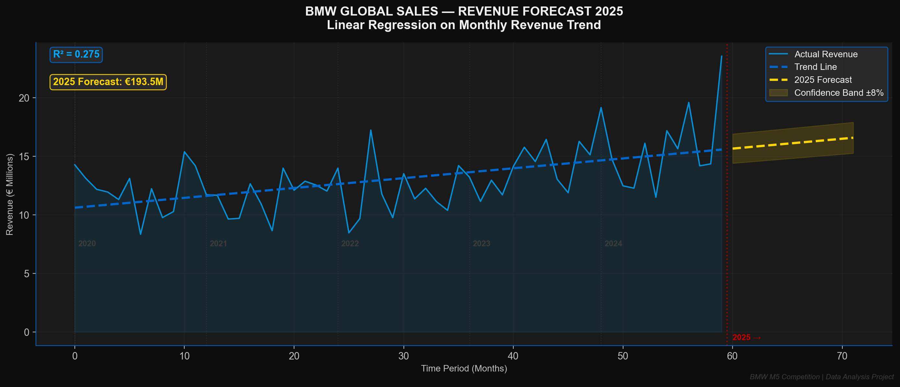

**What the model is telling us:**
- **R² = 0.275** — the upward trend explains 27.5% of monthly revenue variance, confirming a genuine growth signal
- **2025 Total Forecast: €193.5M** — the model's central estimate based on the 2020–2024 linear trend
- **Confidence Band ±8%** — lower bound ≈€178M, upper bound ≈€209M
- **2021 dip sits clearly below the trend line** — confirms it was a one-time external shock, not a structural decline
- **2024 Dec spike** — the final data point shows strong momentum heading into 2025

> ⚠️ **Honest Analyst Note:** Linear regression with R²=0.275 means 72.5% of variance is unexplained — seasonal patterns, economic shocks, and competition are not captured. For production use, ARIMA or Facebook Prophet with seasonal decomposition would be significantly more robust. This forecast is directional guidance, not a financial commitment.

> 💡 **Business Insight:** If 2025 actual revenue falls below €178M (lower band), an immediate strategic review is warranted. Key upside risks that could push above €209M: India market activation, expanded Lease programme, and accelerated EV portfolio rollout — all three are directly actionable decisions available today.

---

### 📊 Chart 13 — Revenue Forecast Animated

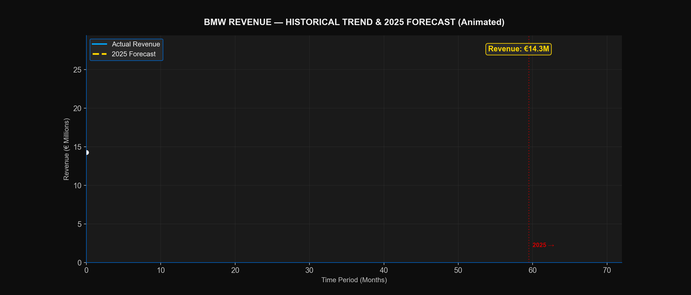

> 🎬 *Watch the revenue line draw itself month by month from 2020 through 2024, crossing the red 2025 boundary line into the forecast zone*

---

## 📸 Phase 4 — Power BI Dashboard (BMW M5 Black Edition)

### 🖥️ Page 1 — Executive Overview
> Total Revenue • Gross Profit • Profit Margin • Units Sold • Transactions • Avg Satisfaction | Revenue Trend 2020–2024 | Revenue by Region | Top 5 Models Donut | Year & Region Slicers

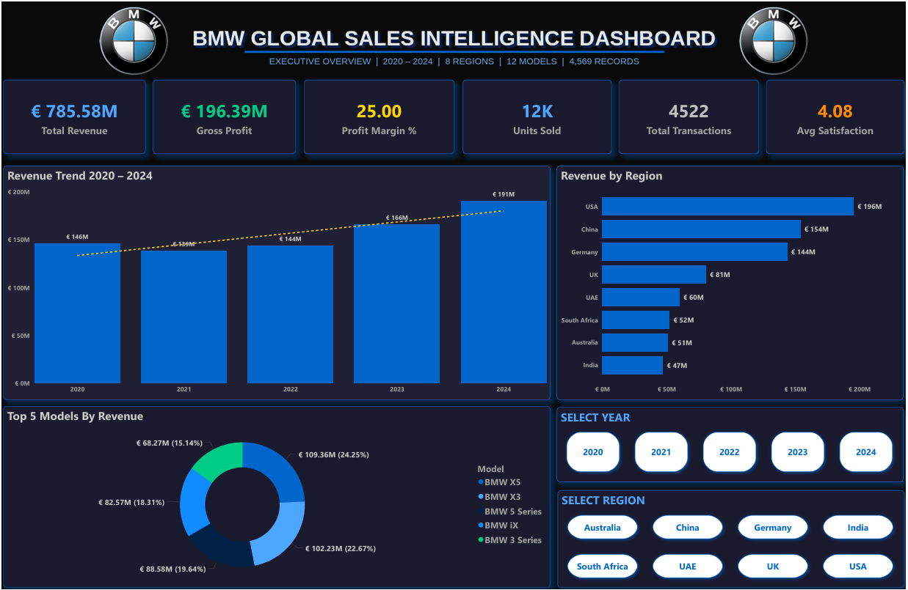

---

### 🖥️ Page 2 — Revenue & Profit Analysis
> Revenue vs Gross Profit bars | YoY Growth % line | Quarterly Revenue Matrix | Revenue by Fuel Type Donut | Year Slicer

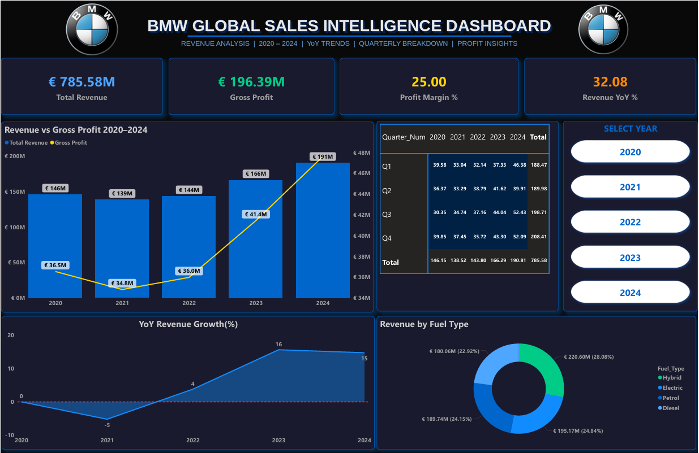

---

### 🖥️ Page 3 — Regional Performance
> World Map with Revenue Bubbles | Revenue by Country bars | Revenue & Margin Treemap | Year & Country Slicers

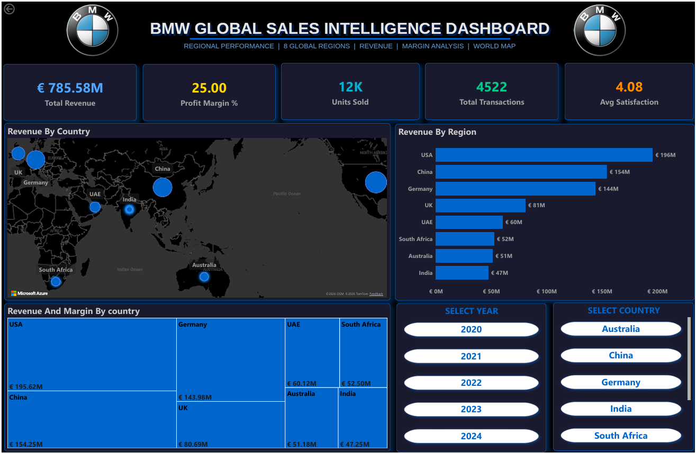

---

### 🖥️ Page 4 — Model Portfolio Analysis
> Revenue by Model | Units Sold Treemap | Model Revenue Trend 2020–2024 | Fuel Type & Model Slicers

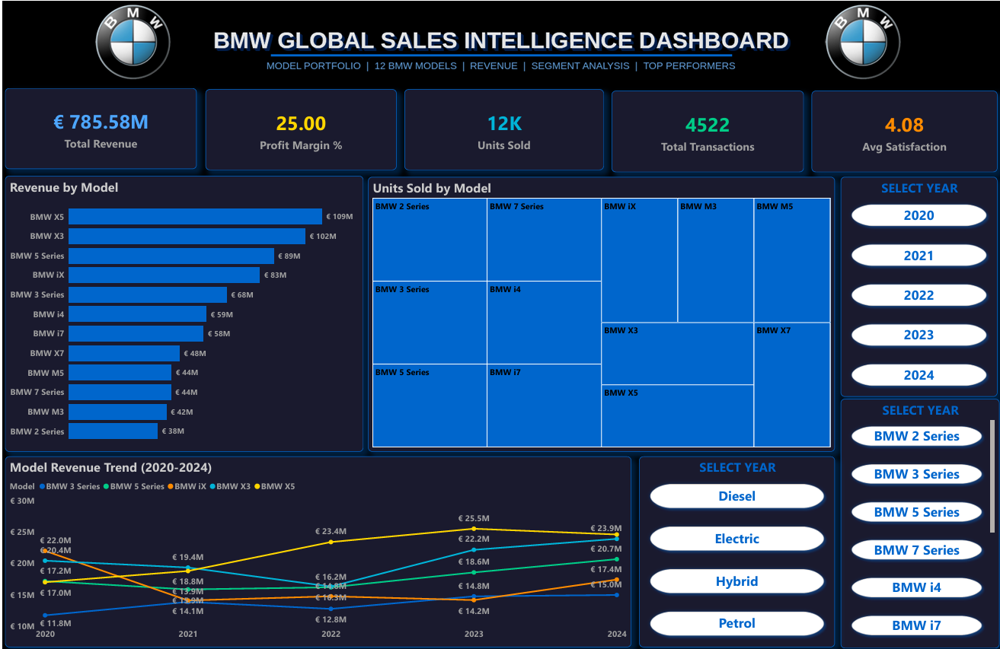

---

## 💼 Key Business Insights — Executive Summary

```
📈  Revenue: €146M (2020) → €191M (2024)  |  +30.6% total  |  CAGR ~6.9%
⚠️  Profit margin flat at exactly 25.00% for 5 consecutive years — zero efficiency gains from growth
🌍  USA leads revenue (€195.6M) but has the LOWEST margin (24.86%) — discount culture is destroying profit
🚗  BMW X5 = #1 total revenue (€109.4M)  |  BMW i7 = #1 revenue per sale (€318.9K avg)
⚡  Electric buyers are the HAPPIEST customers (4.10/5) — EV transition is a satisfaction and revenue win
🏢  Corporate Fleet = 44.4% of all revenue — one lost client cluster = major revenue shock risk
📅  Q3 (Jul–Sep) strongest every year  |  Jan–Feb weakest every year — highly predictable, plan around it
🇮🇳  India = €47.25M — less than 25% of USA revenue from a 1.4 billion population economy
💰  Discounts have -0.01 correlation with revenue AND hurt gross profit — restructure discount policy immediately
🔮  2025 Forecast: €193.5M central estimate (range: €178M – €209M)
```

---

## 🎯 Business Recommendations

| # | Recommendation | Estimated Impact | Effort |
|:---:|---|:---:|:---:|
| 1 | **Fix USA discount structure** — reduce dealer incentives, target 25.5%+ margin | +€1M profit, 0 new customers | 🟡 Medium |
| 2 | **India market activation** — dedicated entry strategy for 1.4B population economy | High long-term revenue upside | 🔴 High |
| 3 | **Implement tiered discount policy** — replace random dealer discounts with structured framework | Protect 1–2% margin globally | 🟢 Low |
| 4 | **Accelerate EV portfolio expansion** — Electric leads satisfaction (4.10) and revenue | CX + regulatory compliance win | 🔴 High |
| 5 | **Grow the Lease segment** — highest satisfaction + strong revenue share, lowest churn risk | Steady low-risk revenue growth | 🟡 Medium |
| 6 | **Reduce Corporate Fleet dependency** — diversify so no single segment > 35% of revenue | Reduce concentration risk | 🟡 Medium |
| 7 | **Expand BMW i7 to UAE + India** — €318.9K per transaction, proven demand exists | High revenue per unit | 🟢 Low |
| 8 | **Q1 activation campaign (Feb–Mar)** — close the consistent Jan–Feb seasonal gap | +€5–8M incremental annually | 🟢 Low |
| 9 | **Cost optimisation programme** — break the Revenue=COGS 0.99 lock, target 27%+ margin | +€15M profit potential | 🔴 High |
| 10 | **Deploy 4-segment CRM strategy** — differentiated approach per K-Means cluster | Improved conversion efficiency | 🟡 Medium |

---

## 📂 Project Structure

```
BMW-Global-Sales-Analysis/
│
├── 📄 BMW_Sales_Raw.csv                   # Raw dataset — 4,569 rows, 29 cols, unclean
├── 📄 BMW_Sales_Cleaned_v1.csv            # Phase 1 output — cleaned & flagged dataset
├── 📄 BMW_Sales_Phase4_Ready.csv          # Final dataset exported for Power BI
│
├── 📓 BMW_Phase3_Analysis.ipynb           # Phase 3 — Full EDA + K-Means + Forecasting
├── 📓 BMW_SQL_DATA_LOAD.ipynb             # Phase 2 — MySQL data loader via SQLAlchemy
│
├── 🗄️  BMW_SQL_Analysis.sql               # Phase 2 — All 8 SQL business queries
│
├── 📊 BMW_Sales_Dashboard.pbix            # Phase 4 — Power BI Dashboard (4 pages)
│
├── 🖼️  dashboard_overview.png             # Page 1 — Executive Overview
├── 🖼️  dashboard_revenue_trend.png        # Page 2 — Revenue & Profit Analysis
├── 🖼️  dashboard_region.png               # Page 3 — Regional Performance
├── 🖼️  dashboard_model.png                # Page 4 — Model Portfolio
│
├── 📁 BMW_Visuals/                         # Phase 3 — All Python chart exports
│   ├── 00_color_palette.png               # BMW M5 Black color palette
│   ├── 01_distributions.png               # Key Variable Distributions
│   ├── 02_correlation_heatmap.png         # Correlation Matrix
│   ├── 03_annual_revenue_animated.gif     # Annual Revenue & Profit (Animated)
│   ├── 04_monthly_heatmap.png             # Monthly Revenue Heatmap
│   ├── 05_world_map_animated.html         # Interactive World Map (Animated)
│   ├── 06_regional_analysis.png           # Regional Revenue & Margin
│   ├── 07_model_analysis.png              # Model Performance Analysis
│   ├── 08_customer_segment.png            # Customer Segment Analysis
│   ├── 09_fuel_gender_analysis.png        # Fuel Type & Gender Analysis
│   ├── 10_kmeans_elbow.png                # Optimal K Selection (Elbow + Silhouette)
│   ├── 11_kmeans_clusters.png             # K-Means Results (K=4)
│   ├── 12_revenue_forecast.png            # Revenue Forecast 2025
│   └── 13_forecast_animated.gif           # Revenue Forecast Animated
│
├── 📝 BMW_Project_Report.docx             # Full project documentation report
└── 📝 BMW_SQL_Analysis_Report.docx        # SQL analysis findings report
```

---

## 🛠️ Tools & Tech Stack

```
Phase 1  →  Microsoft Excel        — Raw data audit & quality documentation
Phase 2  →  MySQL + Workbench      — Database, warehousing, 8 business queries
           Python (SQLAlchemy)    — Bulk data loader into MySQL via Jupyter
Phase 3  →  Python 3.x             — Full analysis environment (Jupyter Notebook)
           Pandas + NumPy         — Data wrangling & numerical computation
           Matplotlib + Seaborn   — BMW M5 Competition Black custom visual theme
           Scikit-learn           — K-Means clustering (K=4), Linear Regression
Phase 4  →  Power BI Desktop       — 4-page interactive BMW M5 Black dashboard
All      →  Git + GitHub           — Version control & portfolio showcase
```

---

<div align="center">

## 👨‍💻 Author

**Devesh Shukla**
*Data Analyst · Excel · SQL · Python · Power BI · Machine Learning*

*6 months internship experience @ Access Million | Turning raw data into real business decisions*

<br>

[](https://www.linkedin.com/in/devesh-shukla23)
[](https://github.com/DeveshShukla23)
[](mailto:shukladevesh40@gmail.com)

<br>

*"The data told a €785M story across 8 countries, 12 models and 5 years.*
*My job was to make sure every decision-maker could read every line of it."* 🚗

<br>

⭐ **If this project added value, please give it a star!** ⭐


</div>
